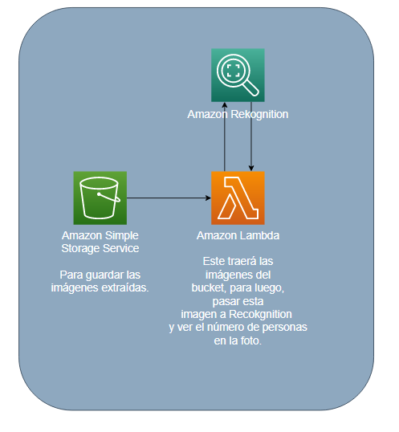

# Titulo

Detección de multitudes con Amazon Rekognition

## Descripción

En este repositorio encontrará una aplicacion con la siguiente arquitectura:

### Prerrequisitos

Este repositorio es para aplicar en los servicios de AWS, por lo que se debe tener una cuenta en AWS.

### Guía de uso

1. Crear un bucket en S3.
2. Crear una función lambda con el código del archivo ubicado en ./src/lambda.
3. En el bucket creado crear una nueva notificación de eventos, en la cual se debe seleccionar la función lambda creada en el paso anterior.
4. Subir las imagenes a analizar en el bucket creado en el paso 1.
5. En el servicio de CloudWatch ir a los registros de la función lambda creada en el paso 2 y revisar los resultados.

## Pruebas

Para ver las pruebas de funcionamiento del proyecto se puede dirigir al siguiente link: [Implementación detección de multitudes en AWS](https://youtu.be/1Bkl2CfsEKU)

## Autor

- **Juan Carlos Baez Lizarazo** - [juanbaezl](https://github.com/juanbaezl)
- **Nicolas Palacios** - [nicolaspalacios-f](https://github.com/nicolaspalacios-f)
- **Diego Leon** - [diegoleonb](https://github.com/diegoleonb)
- **Jhon Sebastian Piñeros** - [sebas679pb](https://github.com/sebas679pb)

## Fecha

Noviembre, 2022

## Licencia

Para más información ver: [LICENSE.txt](License.txt)
